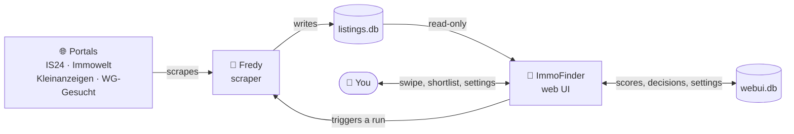

<div align="center">

# ImmoFinder 🏡

**A self-hosted cockpit for flat hunting.**
It scores every listing your scrapers find, lets you swipe through them in seconds,
and keeps track of what you liked and who you already wrote to.

ImmoFinder is the decision layer on top of [Fredy](https://github.com/orangecoding/fredy).
Fredy finds the listings. ImmoFinder helps you get through them.

[](LICENSE)
[](https://nextjs.org)
[](https://www.typescriptlang.org)
[](docker-compose.yml)

[Quick start](#quick-start) · [Features](#features) · [Configuration](docs/configuration.md) · [Legal](#legal--fair-use)

</div>

> [!IMPORTANT]
> ImmoFinder automates access to real-estate portals. That may conflict with those
> portals' terms of service, and the risk — including having your account suspended —
> is yours alone. It is built for one household's own search, not for bulk collection
> or resale. Please read [Legal & fair use](#legal--fair-use) before running it.

---

## Why

Flat hunting in a tight market is a volume problem wearing a taste problem's clothes.

- Portals notify you late, and by the time you open the mail the listing is gone.
- The same flat appears on four sites, so you read it four times.
- Nine out of ten hits are wrong on price, size or location — but you still have to
  open each one to find out.
- Two weeks in, you cannot remember whether you already wrote to that place.

Fredy solves the first half: it watches the portals and writes what it finds into a
database. But it hands you a list, and a list is exactly the thing that does not
scale when there are three hundred of them.

**ImmoFinder is the other half.** Every listing gets a 1–5 star score from your own
criteria, so the list arrives pre-sorted. Then you swipe through it — right to keep,
left to drop — and what survives lands on a shortlist that remembers who you already
contacted.

---

## Features

- **Scoring you control.** Price per person, distance, room count and floor area per
  person, each with its own weight. Missing data is skipped rather than punished — the
  remaining components are re-normalised, so a listing without a floor area is not
  quietly ranked below one that has a bad floor area.
- **A swipe deck.** Right to shortlist, left to discard, down for maybe, with keyboard
  shortcuts and an undo. Every decision is optimistic and rolls back if the write fails.
- **A shortlist that tracks contact.** Mark a listing contacted and it moves into its
  own section, dimmed, with the date — so you never write to the same landlord twice.
- **Availability checks.** ImmoFinder re-probes active listings in the background and
  marks the ones that have disappeared. A blocked or timed-out check is reported as
  *unknown*, never as gone.
- **Address back-fill.** Roughly one listing in six arrives without usable coordinates.
  ImmoFinder resolves those addresses itself and caches them by address, not by listing.
- **A job wizard.** Paste a portal search URL, press check. ImmoFinder validates it the
  same way Fredy will later scrape it, names the exact parameter if the portal rejects
  it, and creates the job for you.
- **Hard filters, and a search that can see past them.** Filters keep the lists clean,
  and the search page can put the hidden listings back with one switch — so a filter
  you set two weeks ago never permanently loses something.
- **Nothing is lost by accident.** Deleting is a soft delete with an undo, in bulk if
  you like, and a restore that puts the old status back.
- **Work happens in the background.** A scrape run chains automatically into an
  availability sweep and an address back-fill, with live progress in the status bar.
- **A dashboard that says what to do next.** Unrated count, shortlist, top picks and
  the age of the newest listing, plus where your listings actually come from.
- **Job management without leaving the app.** Create, edit, enable, run and delete
  Fredy jobs, including the scrape interval, from the Scraping page.
- **Bilingual, light and dark.** Full English and German UI, switchable per visitor.
- **Locked down by default.** One shared password, a signed session cookie, fail-closed
  configuration, rate-limited login, and no port exposed beyond localhost unless you
  say so.

---

## How it works



Two containers, two SQLite databases, one direction of trust:

| | |
|---|---|
| **Fredy** | Scrapes the portals on a schedule and writes what it finds into `listings.db`. Upstream project, pulled as an image — no Fredy source lives in this repo. |
| **ImmoFinder** | Opens `listings.db` **read-only**, scores it, and keeps everything of its own — swipe decisions, settings, contact markers, availability results, the geocode cache — in a separate `webui.db`. |

Because ImmoFinder never writes to Fredy's database, a broken or half-upgraded Fredy
can never be caused from this side, and you can wipe `webui.db` without losing a single
scraped listing.

---

## Quick start

**Requirements:** Docker with the Compose plugin. Nothing else — no Node, no build
tools on the host.

```bash
git clone https://github.com/izqkk/immofinder.git
cd immofinder
cp .env.example .env
```

Now fill in `.env`. Two values are mandatory and the app refuses to serve anything
without them:

```bash
# a password of at least 12 characters, and a secret of at least 32
echo "APP_PASSWORD=$(openssl rand -base64 18)" >> .env
echo "AUTH_SECRET=$(openssl rand -hex 32)"     >> .env
```

> [!TIP]
> Those two `echo` lines append fresh values. If you prefer to choose the password
> yourself, edit `.env` instead — just keep it to 12 characters or more.

Start both services:

```bash
docker compose up -d
```

ImmoFinder is now running on **http://localhost:3000**, and Fredy's own UI on
**http://localhost:9998**.

### First run

1. **Log into Fredy** at http://localhost:9998 — the default credentials are
   `admin` / `admin`. Change the password.
2. **Put those credentials into `.env`** as `FREDY_API_USER` and
   `FREDY_API_PASSWORD`, then `docker compose up -d webui` to pick them up. This is
   what lets ImmoFinder create jobs and trigger scrape runs for you.
3. **Log into ImmoFinder** at http://localhost:3000 with `APP_PASSWORD`.
4. **Create a search job.** Go to *Scraping → New job*, then open a portal in another
   tab, search the way you normally would — city, price, rooms — sort by newest, and
   paste that results URL into the wizard. Press check; ImmoFinder tells you whether
   the portal accepted it and roughly how many hits it sees.
5. **Set your criteria** under *Settings*: how many people are moving in, your total
   budget, and the address you want to be near. The starting address is resolved to
   coordinates when you save.
6. **Run it.** *Scraping → Run all jobs*, wait for the status bar to finish, then go
   swipe.

> [!NOTE]
> The first run treats every listing it finds as new, so expect a large batch. That is
> normal — it is the only time it happens.

### Where the data lives

Everything persists in `./data` next to `docker-compose.yml`:

```
data/
├── fredy/conf/     Fredy's configuration
├── fredy/db/       listings.db  — scraped listings
└── webui/          webui.db     — your decisions, settings and cache
```

Both are plain SQLite files. Backing ImmoFinder up is `cp -r data data.bak`.

---

## Configuration

The split is deliberate: **environment variables** are for the operator, **the Settings
screen** is for the searcher.

The essentials:

| Variable | Default | Effect |
|---|---|---|
| `APP_PASSWORD` | — | Shared login password, **min. 12 characters**. Required. |
| `AUTH_SECRET` | — | Session-cookie signing key, **min. 32 characters**. Required. |
| `FREDY_API_USER` / `FREDY_API_PASSWORD` | — | Fredy login, so ImmoFinder can manage jobs. |
| `BIND_ADDRESS` | `127.0.0.1` | Interface the ports bind to. |
| `WEBUI_PORT` / `FREDY_PORT` | `3000` / `9998` | Host ports. |
| `TRUST_PROXY` | unset | `1` behind a reverse proxy that sets `X-Forwarded-*`. |
| `REQUIRE_HTTPS` | unset | `1` once the instance is HTTPS-only. |
| `DEFAULT_LOCALE` | `en` | `en` or `de`, for visitors who have not chosen. |

**→ [Full configuration reference](docs/configuration.md)** — every variable, every
setting in the UI, and what the scoring model actually does with them.

**→ [Running several instances](docs/multi-instance.md)** — one search per instance,
isolated by Compose project name.

---

## Supported portals

Portals come from Fredy, so this list follows whatever your Fredy version supports.
ImmoFinder adds URL validation and a display label for these four:

| Portal | Job wizard | Availability check |
|---|---|---|
| ImmobilienScout24 | ✅ validates against the mobile API, and names the parameter behind an HTTP 412 | ✅ via the mobile API — the web URL is blocked by bot protection |
| Immowelt | ✅ | ✅ |
| Kleinanzeigen | ✅ (also accepts legacy `ebay-kleinanzeigen.de` links) | ✅ |
| WG-Gesucht | ✅ | ✅ |

Any other Fredy provider still works end to end — its listings are scraped, scored and
swipeable. It simply shows up under its raw provider id instead of a friendly name, and
its search URLs are not pre-validated by the wizard.

---

## Updating

```bash
git pull
docker compose build webui
docker compose up -d
```

Your data is untouched: `./data` is gitignored, nothing in the update path deletes
volumes, and ImmoFinder's schema is created with `IF NOT EXISTS` on every start.

To pull a newer Fredy:

```bash
docker compose pull fredy
docker compose up -d fredy
```

---

## Troubleshooting

<!-- markdownlint-disable MD033 -->

**Every page returns 503, including the login page.**
`APP_PASSWORD` or `AUTH_SECRET` is missing or too short (12 and 32 characters
respectively). This is deliberate: there is no configuration in which ImmoFinder falls
open. Check with `docker compose exec webui env | grep -E 'APP_PASSWORD|AUTH_SECRET'`.

**Login does nothing, or the session is lost immediately.**
`REQUIRE_HTTPS=1` while you are reaching the app over plain `http`. Either put HTTPS in
front of it or leave that variable empty.

**Behind a reverse proxy, all failed logins share one rate-limit bucket.**
Set `TRUST_PROXY=1` so the client IP is read from `X-Forwarded-For`. Only do this when
a proxy really is in front — otherwise the header is attacker-controlled.

**The Scraping page shows a configuration notice.**
`FREDY_API_USER` / `FREDY_API_PASSWORD` are unset. Listings still work; job management
does not.

**Fredy exits right after start.**
Some Fredy versions expect a config file to already exist in the mounted volume. Create
a minimal one and start again:

```bash
mkdir -p data/fredy/conf
printf '{"sqlitepath":"/db"}' > data/fredy/conf/config.json
docker compose up -d fredy
```

**Listings have no distance.**
Either no starting address is set in Settings, or the portal published an address the
geocoder could not resolve. ImmoFinder retries unresolved addresses in the background;
addresses that produced no hit at all are left alone for a week rather than re-queried
every run.

**Fredy's scraping stops finding anything on ImmobilienScout24.**
Usually a search URL the mobile API rejects with HTTP 412. Re-run it through the job
wizard — it names the exact parameter, which is almost always a `sorting` value or
`pricetype=calculatedtotalrent` on a house-rental URL.

**Chromium crashes in a loop / the disk fills up.**
Already handled in `docker-compose.yml` via `shm_size: 512m` and `ulimits.core: 0`. If
you wrote your own compose file, carry those two over.

---

## Development

```bash
cd webui
npm ci
npm run dev
```

The dev server needs the same two secrets, plus a path to a Fredy database:

```bash
APP_PASSWORD=at-least-twelve-chars \
AUTH_SECRET=$(openssl rand -hex 32) \
FREDY_DB_PATH=../data/fredy/db/listings.db \
npm run dev
```

| Command | What it does |
|---|---|
| `npm run dev` | Dev server on :3000 |
| `npm run build` | Production build |
| `npm run lint` | ESLint (flat config) |
| `npm run typecheck` | `tsc --noEmit` |
| `npm test` | Vitest — 82 unit tests across auth, geocoding, URL parsing, maps, background tasks and navigation |

**Stack:** Next.js 16 (App Router, React Server Components, Server Actions), React 19,
Tailwind CSS v4, shadcn/ui, `better-sqlite3`, Vitest.

### Project layout

```
.
├── docker-compose.yml       Both services; everything configurable via .env
├── .env.example             Every variable, documented
├── docs/                    Configuration reference, multi-instance guide
└── webui/
    ├── app/                 Routes. (app)/ is everything behind the password gate
    ├── components/          UI — ui/ holds the shadcn primitives
    ├── lib/
    │   ├── auth.ts          Sessions, HMAC tokens, rate limiting
    │   ├── db.ts            Both SQLite connections and the schema
    │   ├── score.ts         The scoring model
    │   ├── listings.ts      Query, filter and enrich listings
    │   ├── search-url.ts    Portal detection and search-URL validation
    │   ├── availability.ts  Is this listing still online?
    │   ├── geocode*.ts      Nominatim, with etiquette
    │   └── i18n/            Translations — English is the source of truth
    └── proxy.ts             The request gate: authenticates before anything renders
```

### Adding a language

1. Add the code to `LOCALES` in `webui/lib/i18n/locales.ts`.
2. Copy `webui/lib/i18n/dictionaries/en/` to a directory named after it and translate.
3. Register it in `webui/lib/i18n/dictionaries/index.ts`.

English is the reference shape: a key you forget to translate is a **build error**, not
a blank label at runtime.

---

## Known limitations

- **Distances are straight-line.** No travel-time lookup, so a listing five kilometres
  away across a river may be a much longer trip than the number suggests.
- **One password, no accounts.** Everyone with the password sees the same shortlist.
  That is the point — it is built for a household searching together — but it means
  ImmoFinder is not multi-tenant. Run separate instances instead.
- **Availability checks are best-effort.** Portals block automated requests; a blocked
  check is reported as unknown rather than guessed at.
- **German-market defaults.** The single-room detection ships with German terms because
  every supported portal is a German one. They are editable in Settings.
- **Scraping is inherently brittle.** When a portal changes its markup, Fredy is where
  that gets fixed, not here.

---

## Legal & fair use

> [!CAUTION]
> **Read this before you run ImmoFinder.**
>
> ImmoFinder and the scraper it builds on retrieve data from real-estate portals
> automatically. Doing so may violate those portals' terms and conditions. **Checking
> whether your use is lawful is your responsibility, and you carry the risk alone** —
> including the concrete and common one of having your account on a portal restricted
> or permanently closed.
>
> This software is provided "as is", without warranty of any kind, express or implied.
> The authors and contributors accept no liability whatsoever for how you choose to use
> it, or for any damage, account suspension, or claim by a portal operator, an
> authority or any other third party arising from that use.

**What this project is for.** ImmoFinder was written to make one household's own flat
search bearable. That is the intended use: your search, your criteria, your shortlist.
It is not built for commercial use, for bulk data collection, or for redistributing or
reselling listing data, and please do not repurpose it for any of those.

**Be a good citizen of other people's servers.** The defaults exist for a reason —
please keep them:

- Leave the scrape interval where it is. The Scraping page lets you change it, but
  checking every few minutes finds you nothing a sensible interval would not — and it is
  the single fastest way to get blocked.
- Run the searches you would actually run by hand. A job per city you are genuinely
  considering, not a job per city that exists.
- Respect each portal's `robots.txt` and terms.
- ImmoFinder rate-limits its own geocoding to one request per second and stops entirely
  on HTTP 429 or 5xx. Please do not remove that — Nominatim is a free community service
  run on donated infrastructure.

**Data protection.** Listings may contain personal data of private landlords. The
databases stay on your machine and nothing is sent anywhere else, but that also makes
you the controller for whatever you store. Under the GDPR that carries obligations,
and automated retrieval can additionally touch database rights (in Germany, §§ 87a ff.
UrhG) and copyright.

**None of this is legal advice.** If you are unsure whether your use is permitted,
ask someone qualified before you run it.

**Not affiliated.** ImmoFinder is an independent, unofficial project. It is in no way
affiliated with, authorised by, endorsed by, or connected to ImmobilienScout24,
Immowelt, Kleinanzeigen, WG-Gesucht, or any other portal. All trademarks belong to
their respective owners.

---

## Contributing

Issues and pull requests are welcome — see [CONTRIBUTING.md](CONTRIBUTING.md).

Two things are worth knowing before you open a PR: **portal-scraping changes belong in
[Fredy](https://github.com/orangecoding/fredy)**, not here, and translations should
start from the English dictionary, which is the source of truth.

## License

[MIT](LICENSE) — with one exception documented in [NOTICE](NOTICE): the
ImmobilienScout24 URL translator in `webui/lib/search-url.ts` is derived from Fredy and
carries Fredy's terms.

## Credits

- **[Fredy](https://github.com/orangecoding/fredy)** by Christian Kellner — the scraper
  this whole thing stands on. ImmoFinder would be an empty database without it.
- **[OpenStreetMap](https://www.openstreetmap.org/copyright)** contributors and the
  **Nominatim** service for geocoding. Map data under the ODbL.
- **[shadcn/ui](https://ui.shadcn.com)**, **[Radix UI](https://www.radix-ui.com)** and
  **[Lucide](https://lucide.dev)** for the interface primitives.
